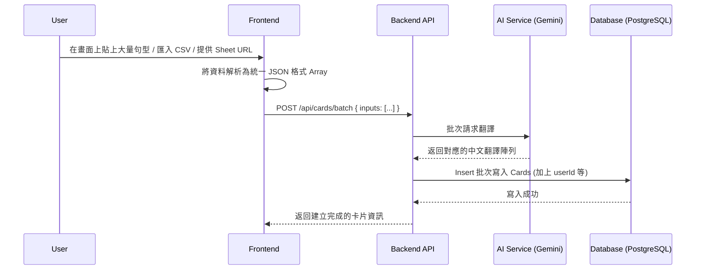

# Batch Translation API & Database Design

## 目標
建立支援批次匯入（如 Google Sheet、CSV 或畫面輸入）文字/句子，對其進行 AI 翻譯成繁體中文並存入資料庫的 API。同時建立包含帳戶名稱與密碼的 `User` 與 `Card` 資料表的關聯設計。

## 1. 資料庫 Schema 設計 (Prisma)
修改 `/server/prisma/schema.prisma` 來支援 `User` 及 `Card` 表格。

```prisma
generator client {
  provider = "prisma-client-js"
}

datasource db {
  provider = "postgresql"
  url      = env("DATABASE_URL")
}

model User {
  id        Int      @id @default(autoincrement())
  account   String   @unique
  password  String   // 密碼需透過 bcrypt 進行 Hash 後儲存
  createdAt DateTime @default(now())
  updatedAt DateTime @updatedAt
  cards     Card[]   // 反向關聯字卡
}

model Card {
  id             Int      @id @default(autoincrement())
  originalText   String   // 原文/輸入的句子
  translatedText String   // AI 翻譯出的中文
  userId         Int      // 外來鍵指向 User
  user           User     @relation(fields: [userId], references: [id], onDelete: Cascade)
  createdAt      DateTime @default(now())
  updatedAt      DateTime @updatedAt
}
```

## 2. 系統架構流圖


## 3. API 路由設計

### 選項 A：統一由前端處理檔案轉換（推薦）
將 CSV 解析、Google Sheets 處理留在前端。由前端讀檔後提取陣列。後端 API 只專注於接收「字串陣列」、呼叫 AI 翻譯與資料庫寫入。這能大幅降低後端處理檔案的複雜度與減少資安風險。

#### `POST /api/cards/batch`
- **授權 (Header)**: `Authorization: Bearer <token>`
- **Request Body**:
  ```json
  {
    "inputs": [
      "Hello, how are you?",
      "I want to improve my English speaking skills."
    ]
  }
  ```
- **處理邏輯**:
  1. 驗證 Authorization Header（並取得 `userId`）。
  2. 組合提示詞 (Prompt)，將此 `inputs` 陣列輸入給 AI (Gemini)。利用 Structured Output 要求 AI 強制回傳 JSON，格式為 `[{ "original": "...", "translated": "..." }]`。
  3. 將 AI 回傳的陣列，透過 Prisma `prisma.card.createMany(...)` 批次寫入 PostgreSQL。
- **Response**:
  ```json
  {
    "success": true,
    "count": 2,
    "data": [
      {
        "id": 1,
        "originalText": "Hello, how are you?",
        "translatedText": "你好，你好嗎？",
        "userId": 1,
        "createdAt": "...",
        "updatedAt": "..."
      }
    ]
  }
  ```

### 選項 B：後端支援檔案上傳 (若前端無法解析)
若需由後端解析檔案，可增加針對 CSV 特化的 Endpoint。使用 `multer` 和 `csv-parser` 進行處理。

#### `POST /api/cards/upload/csv`
- **Header**: `Content-Type: multipart/form-data`
- **Body**: 夾帶 `file` 變數 (CSV)。
- 處理邏輯：後端讀取並解析 CSV 取出列資料後，後續同樣呼叫 AI 以及呼叫 Prisma 寫入 DB。

## 4. 實作考量點 (Important)
- **Token 與 Rate Limit 控制**：如果用戶一次匯入上千句，有可能超出 AI 額度 (Token limits)。實作時應在後端設計 Chunk 邏輯 (例如：每次 50 句打包成一個 Batch 呼叫 AI API，最後合併入庫)。
- **User 密碼加密**：註冊與登入時，密碼絕不可明碼儲存，需安裝 `bcrypt` 來進行雜湊 (Hash)。
- **資料表異動**：因為目前 `server/prisma/schema.prisma` 裡有之前測試的 `MemoryCard`，可以在下一次 Migration 時移除或轉換為目前設計的 `Card`。
