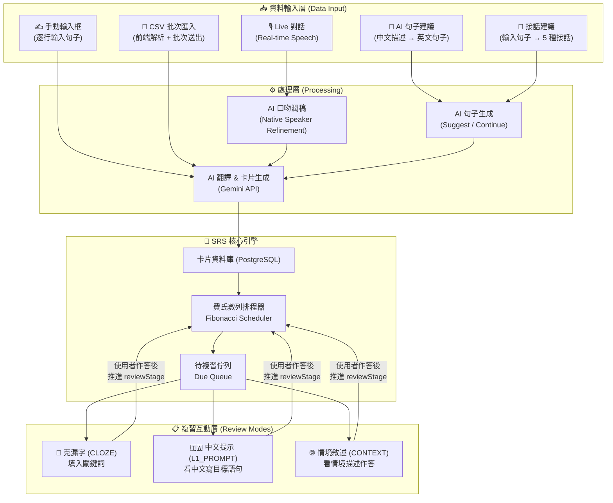

# MySpeak — Roadmap & Function Map

> 本文件描述 MySpeak 的整體功能路線圖與函數對應關係。  
> 以「SRS 複習系統」為核心，向外延伸多條資料輸入路徑，再串接三種複習互動形式。

---

## 一、系統全景架構



---

## 二、Feature Roadmap

### Phase 1 — 核心 SRS 基礎建設 ✅ 全部完成

| 功能 | 狀態 | 說明 |
|------|------|------|
| 後端 Express + Prisma 架構 | ✅ 已完成 | `server/src/index.js` |
| `User` / `Card` 資料庫 Schema | ✅ 已完成 | `server/prisma/schema.prisma` |
| AI 生成三種卡片類型 (CLOZE / L1_PROMPT / CONTEXT) | ✅ 已完成 | `cardsService.processBatchTranslation` |
| 費氏數列 SRS 排程器 | ✅ 已完成 | `utils/srs.js` + `reviewStage` |
| 取得待複習卡片 | ✅ 已完成 | `GET /api/cards/due` |
| 標記複習完成 & 推進 Stage | ✅ 已完成 | `POST /api/cards/:id/review` |
| 前端複習 UI（克漏字 / L1 / 情境） | ✅ 已完成 | `ReviewSessionPage.jsx` + `useReviewSession.js` |
| 複習卡片依類型排序（CLOZE → L1 → CONTEXT） | ✅ 已完成 | `useReviewSession.js` `sortByType()` |
| Prisma Apple Silicon 修正 | ✅ 已完成 | `binaryTargets = ["native", "darwin-arm64"]` |

### Phase 2 — Live 對話 → SRS 整合 ✅ 全部完成

| 功能 | 狀態 | 說明 |
|------|------|------|
| Live Speaking 對話（前端） | ✅ 已完成 | `GeminiLiveClient.js` + `ImmersiveOrb` |
| 對話轉錄文字 (Transcript) | ✅ 已完成 | `useSessionManager` hook |
| 對話後 AI 口吻潤稿 | ✅ 已完成 | `cardsService.processLiveRefinement` + `POST /api/cards/refine` |
| 潤稿後的句子存入 SRS | ✅ 已完成 | 潤稿結果串接 `processBatchTranslation` |
| RefinementDashboard 原句 vs 潤稿對照 | ✅ 已完成 | `RefinementDashboard.jsx` |

### Phase 2.5 — 卡片管理與 AI 輔助輸入 ✅ 全部完成

| 功能 | 狀態 | 說明 |
|------|------|------|
| 卡片列表頁面 | ✅ 已完成 | `CardManagerPage.jsx` + `useCardManager.js` |
| 依原句分組顯示 | ✅ 已完成 | 同一原句的 3 張卡片折疊在一起 |
| 單組卡片刪除 | ✅ 已完成 | `DELETE /api/cards/:id`（刪除同 originalText 整組） |
| 卡片內容編輯 | ✅ 已完成 | 可修改 question / answer，`PATCH /api/cards/:id` |
| 手動輸入框批次新增 | ✅ 已完成 | `AddCardsForm`，每行一句 → `POST /api/cards/batch` |
| CSV 批次匯入 | ✅ 已完成 | `CSVImportForm`，前端解析 + 預覽 → `POST /api/cards/batch` |
| AI 句子建議（中文描述 → 英文句子） | ✅ 已完成 | `AskAIForm` + `POST /api/cards/suggest` |
| 接話建議（輸入句子 → 5 種接話） | ✅ 已完成 | `ContinueSentenceForm` + `POST /api/cards/continue` |

### Phase 3 — 使用者體驗與正式上線

| 功能 | 狀態 | 說明 |
|------|------|------|
| 完整使用者認證流程 | ❌ 待開發 | 登入 / 註冊 / JWT |
| 複習進度統計 Dashboard | ❌ 待開發 | 學習曲線、streak、答對率 |
| 批次匯入 Chunk 機制（避免 Token 超量） | ⚠️ 未實作 | 大量句子時需分批送 Gemini |
| 行動裝置 RWD 優化 | ❌ 待開發 | — |

---

## 三、Function Map

### 3.1 資料輸入路徑 A — 手動輸入 / CSV 批次匯入

```
[前端 CardManagerPage.jsx]
  ├─ AddCardsForm
  │    ├─ textarea 每行一句
  │    └─ onAdd(sentences[]) → useCardManager.addCards()
  │
  └─ CSVImportForm
       ├─ <input type="file" accept=".csv">
       ├─ parseCSV(rawText) → string[]
       │    # 取第一欄、略過空行、自動跳過標題列
       ├─ 預覽畫面（前 5 句 + 總數）
       └─ onAdd(sentences[]) → useCardManager.addCards()

[hooks/useCardManager.js]
  └─ addCards(sentences[])
       └─ POST /api/cards/batch  { inputs: sentences }

[後端]
  └─ POST /api/cards/batch
       └─ cardsController.createBatchCards
            └─ cardsService.processBatchTranslation(inputs, userId)
                 ├─ Gemini API → [{original, cards:[{cardType, question, answer}]}]
                 ├─ flatMap → Card 列表（3 cards/句）
                 └─ cardsRepository.createManyCards(dataToInsert)
```

### 3.2 資料輸入路徑 B — Live 對話 → Native Refinement → SRS

```
[前端]
  └─ App.jsx handleStartLiveSpeak
       ├─ GeminiLiveClient.connect(systemPrompt)
       ├─ useAudioStreamer → 麥克風 PCM chunks → GeminiLiveClient.sendAudio()
       ├─ handleAIAudioResponse(base64PCM) → Web Audio API 播放
       └─ useSessionManager → transcript[]

  → 對話結束 → RefinementDashboard
       ├─ 顯示用戶發言 transcript
       └─ submitForRefinement(userUtterances[]) → POST /api/cards/refine

[後端]
  └─ POST /api/cards/refine
       └─ cardsController.refineAndCreateCards
            └─ cardsService.processLiveRefinement(utterances, userId)
                 ├─ Gemini API → [{original, refined}]（保留原意 + 母語口吻）
                 ├─ 只取有改動的句子 (refined !== original)
                 └─ cardsService.processBatchTranslation(refinedSentences, userId)
```

### 3.3 資料輸入路徑 C — AI 輔助生成

```
[前端 CardManagerPage.jsx]
  ├─ AskAIForm（中文描述 → 英文句子建議）
  │    ├─ 輸入：中文說明想表達的意思
  │    ├─ useCardManager.suggestSentences(query) → POST /api/cards/suggest
  │    └─ 回傳 5 個英文句子，每句旁有「加入卡片」按鈕
  │
  └─ ContinueSentenceForm（輸入句子 → 接話建議）
       ├─ 輸入：一句英文
       ├─ useCardManager.continueSentence(sentence) → POST /api/cards/continue
       └─ 回傳 5 種接話方式，每句旁有「加入卡片」按鈕

[後端]
  ├─ POST /api/cards/suggest
  │    └─ cardsService.generateSentenceSuggestions(query)
  │         └─ Gemini API → string[5]（涵蓋輕鬆到正式語氣）
  │
  └─ POST /api/cards/continue
       └─ cardsService.generateContinuations(sentence)
            └─ Gemini API → string[5]（涵蓋同理、好奇、輕鬆等語氣）

兩者皆可一鍵將建議句子送入 POST /api/cards/batch 生成卡片。
```

### 3.4 SRS 複習引擎

```
[排程核心]
  utils/srs.js
    └─ getFibonacciInterval(stage) → days
         # stage 1→1天, 2→2天, 3→3天, 4→5天, 5→8天, ...
         # 超過 10 後 cap 至 89 天

[取得待複習]
  GET /api/cards/due
    └─ cardsController.getDueCards
         └─ cardsService.fetchDueCards(userId)
              └─ cardsRepository.findDueCards(userId)
                   └─ prisma.card.findMany({
                        where: { userId, nextReviewDate: { lte: now() } },
                        orderBy: { nextReviewDate: asc }
                      })

[標記完成 & 推進]
  POST /api/cards/:id/review
    └─ cardsController.reviewCard
         └─ cardsService.processCardReview(cardId, userId)
              ├─ cardsRepository.findCardById(cardId)
              ├─ 驗證 card.userId === userId
              ├─ newStage = card.reviewStage + 1
              ├─ daysToAdd = getFibonacciInterval(newStage)
              └─ cardsRepository.updateReviewSchedule(cardId, newStage, nextReviewDate)
```

### 3.5 複習互動 UI（前端）

```
hooks/useReviewSession.js
  ├─ startSession()
  │    ├─ GET /api/cards/due → setCards(sortByType(data))
  │    │    # sortByType: CLOZE(0) → L1_PROMPT(1) → CONTEXT(2)
  │    └─ setStatus('active')
  ├─ revealAnswer()   → setStatus('revealed')
  ├─ markReviewed()
  │    └─ POST /api/cards/:id/review → advance currentIndex
  │         → if last card: setStatus('finished')
  └─ resetSession()   → 回到 idle

components/ReviewSessionPage.jsx
  ├─ useEffect → startSession() on mount
  ├─ status === 'idle'|'loading' → <Spinner> 載入中
  ├─ status === 'error'          → 連線失敗 + 重試按鈕
  ├─ status === 'finished'       → 🎉 今日複習完成
  └─ status === 'active'|'revealed'|'submitting'
       └─ <ReviewCard data-type={cardType}>
            ├─ <CardTypeBadge>（CLOZE 藍 / L1_PROMPT 紫 / CONTEXT 綠）
            ├─ <QuestionText>
            │    CLOZE: '___' → <span class="blank">（底線樣式）
            │    其他: 純文字
            ├─ <AnswerInput> → 使用者輸入 + 比對答案（去標點、不分大小寫）
            ├─ [確認答案] 顯示 ✓ 答對 / ✗ 答錯 + 正確答案
            ├─ [下一張 →] → markReviewed()
            ├─ 🔊 TTS 按鈕 → Web Speech API 朗讀英文
            └─ <StageDots stage={card.reviewStage}>（最多 10 點）

  頂端進度條
    └─ progress = (currentIndex / totalCards) * 100（CSS width transition）
```

### 3.6 卡片管理（CardManagerPage）

```
components/CardManagerPage.jsx
  ├─ AddCardsForm        → 手動輸入句子 → 批次生成卡片
  ├─ CSVImportForm       → 上傳 CSV → 解析 → 預覽 → 批次生成
  ├─ ContinueSentenceForm → 輸入英文句 → AI 接話 → 選擇加入
  ├─ AskAIForm           → 中文描述 → AI 英文建議 → 選擇加入
  └─ 卡片列表（依 originalText 分組，可折疊）
       ├─ 每組顯示卡片數、類型標籤
       ├─ 展開後可編輯每張 question / answer（PATCH /api/cards/:id）
       └─ 刪除整組按鈕（DELETE /api/cards/:id → 刪除同 originalText）

hooks/useCardManager.js
  ├─ loadCards()         → GET /api/cards
  ├─ addCards(sentences) → POST /api/cards/batch
  ├─ deleteGroup(id)     → DELETE /api/cards/:id
  ├─ updateCard(id, q, a)→ PATCH /api/cards/:id
  ├─ suggestSentences(q) → POST /api/cards/suggest
  └─ continueSentence(s) → POST /api/cards/continue
```

---

## 四、資料庫 Schema

```prisma
generator client {
  provider      = "prisma-client-js"
  binaryTargets = ["native", "darwin-arm64"]
}

model User {
  id        Int      @id @default(autoincrement())
  account   String   @unique
  password  String   // bcrypt hashed
  createdAt DateTime @default(now())
  updatedAt DateTime @updatedAt
  cards     Card[]
}

enum CardType {
  CLOZE
  L1_PROMPT
  CONTEXT
}

model Card {
  id             Int      @id @default(autoincrement())
  originalText   String
  question       String
  answer         String
  cardType       CardType

  reviewStage    Int      @default(0)
  nextReviewDate DateTime @default(now())

  userId    Int
  user      User     @relation(fields: [userId], references: [id], onDelete: Cascade)
  createdAt DateTime @default(now())
  updatedAt DateTime @updatedAt
}
```

---

## 五、API Endpoints 總覽

| Method | Path | 狀態 | 說明 |
|--------|------|------|------|
| `POST` | `/api/cards/batch` | ✅ 已完成 | 批次輸入句子 → AI 生成 3 種卡片 |
| `GET` | `/api/cards/due` | ✅ 已完成 | 取得今日待複習卡片 |
| `POST` | `/api/cards/:id/review` | ✅ 已完成 | 標記複習完成，推進 SRS |
| `POST` | `/api/cards/refine` | ✅ 已完成 | Live 對話 → 口吻潤稿 → 存入 SRS |
| `GET` | `/api/cards` | ✅ 已完成 | 取得所有卡片（供 CardManagerPage 使用） |
| `DELETE` | `/api/cards/:id` | ✅ 已完成 | 刪除同 originalText 整組卡片 |
| `PATCH` | `/api/cards/:id` | ✅ 已完成 | 編輯卡片 question / answer |
| `POST` | `/api/cards/suggest` | ✅ 已完成 | 中文描述 → AI 回傳 5 個英文句子建議 |
| `POST` | `/api/cards/continue` | ✅ 已完成 | 輸入英文句 → AI 回傳 5 種接話方式 |
| `POST` | `/api/auth/register` | ❌ 待建 | 使用者註冊 |
| `POST` | `/api/auth/login` | ❌ 待建 | 使用者登入 → 回傳 JWT |

---

## 六、開發進度總結

```
✅ Phase 1 — 核心 SRS 基礎建設（全部完成）
  → ReviewSessionPage：三種卡片 UI + useReviewSession hook
  → 複習卡片排序：CLOZE → L1_PROMPT → CONTEXT
  → 費氏數列排程 + Prisma Apple Silicon 修正

✅ Phase 2 — Live 對話 → SRS 整合（全部完成）
  → GeminiLiveClient + useAudioStreamer + RefinementDashboard
  → POST /api/cards/refine：口吻潤稿 → 存卡

✅ Phase 2.5 — 卡片管理 + AI 輔助輸入（全部完成）
  → CardManagerPage：分組列表、編輯、刪除
  → AddCardsForm：手動逐行輸入
  → CSVImportForm：CSV 上傳 + 前端解析 + 預覽
  → AskAIForm：中文描述 → AI 英文句子建議 → 一鍵加入
  → ContinueSentenceForm：輸入句子 → AI 接話建議 → 一鍵加入

⏳ Phase 3 — 正式上線（待開發）
  → JWT 使用者認證 (register / login)
  → 複習進度統計 Dashboard（streak、答對率）
  → 批次匯入 Chunk 機制（避免 Gemini Token 超量）
  → 行動裝置 RWD 優化
```
