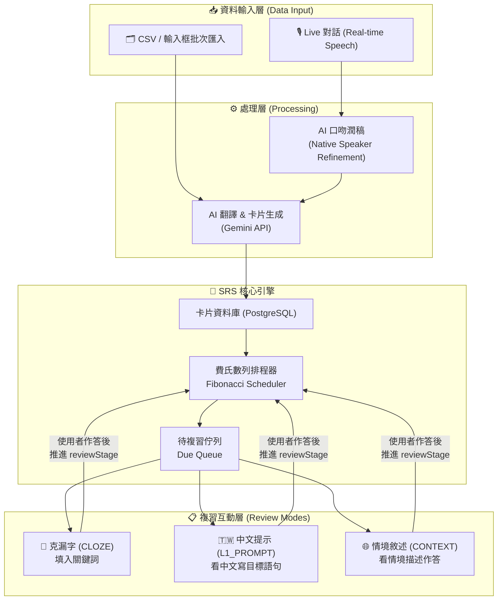

# MySpeak — Roadmap & Function Map

> 本文件描述 MySpeak 的整體功能路線圖與函數對應關係。  
> 以「SRS 複習系統」為核心，向外延伸兩條資料輸入路徑，再串接三種複習互動形式。

---

## 一、系統全景架構



---

## 二、Feature Roadmap

### Phase 1 — 核心 SRS 基礎建設（大部分已完成 ✅）

| 功能 | 狀態 | 說明 |
|------|------|------|
| 後端 Express + Prisma 架構 | ✅ 已完成 | `server/src/index.js` |
| `User` / `Card` 資料庫 Schema | ✅ 已完成 | `server/prisma/schema.prisma` |
| CSV / 輸入框批次匯入 API | ✅ 已完成 | `POST /api/cards/batch` |
| AI 生成三種卡片類型 (CLOZE / L1_PROMPT / CONTEXT) | ✅ 已完成 | `cardsService.processBatchTranslation` |
| 費氏數列 SRS 排程器 | ✅ 已完成 | `utils/srs.js` + `reviewStage` |
| 取得待複習卡片 | ✅ 已完成 | `GET /api/cards/due` |
| 標記複習完成 & 推進 Stage | ✅ 已完成 | `POST /api/cards/:id/review` |
| **前端複習 UI（克漏字 / L1 / 情境）** | ✅ 已完成 | `ReviewSessionPage.jsx` + `useReviewSession.js` |
| Prisma Apple Silicon 修正 | ✅ 已完成 | `binaryTargets = ["native", "darwin-arm64"]` |
| CSV 前端解析介面 | ❌ 待開發 | 需要 CSV 上傳 + 輸入框 UI |
| 使用者認證 (JWT / Login) | ⚠️ 架構預留 | `userRepository` 有 upsert 但無真實 Auth |

### Phase 2 — Live 對話 → SRS 整合

| 功能 | 狀態 | 說明 |
|------|------|------|
| Live Speaking 對話（前端） | ✅ 已完成 | `GeminiLiveClient.js` + `ImmersiveOrb` |
| 對話轉錄文字 (Transcript) | ✅ 已完成 | `useSessionManager` hook |
| **對話後 AI 口吻潤稿** | ❌ 待開發 | 需要新增潤稿 Prompt，對用戶發言做 native refinement |
| **潤稿後的句子存入 SRS** | ❌ 待開發 | 潤稿結果串接 `POST /api/cards/batch` |
| **RefinementDashboard 完整功能** | ⚠️ 部分完成 | 有 UI 外殼，缺少確認 & 儲存行為 |

### Phase 3 — 使用者體驗與穩定性

| 功能 | 狀態 | 說明 |
|------|------|------|
| 完整使用者認證流程 | ❌ 待開發 | 登入 / 註冊 / JWT |
| 複習進度統計 Dashboard | ❌ 待開發 | 顯示學習曲線、streak、成功率 |
| 卡片管理介面 | ❌ 待開發 | 列表 / 刪除 / 編輯 |
| 批次匯入 Chunk 機制（避免 Token 超量） | ⚠️ 已設計 | 尚未實作；spec 中有提及 |
| 行動裝置 RWD 優化 | ❌ 待開發 | — |

---

## 三、Function Map

### 3.1 資料輸入路徑 A — CSV / 輸入框批次匯入

```
[前端]
  └─ CsvImportPage (待建)
       ├─ parseCsv(file) → string[]          # 前端解析 CSV，取出原文欄
       ├─ handleManualInput(text) → string[] # 手動逐行輸入
       └─ submitBatch(inputs[]) → API call

[後端]
  └─ POST /api/cards/batch
       └─ cardsController.createBatchCards(req, res)
            └─ cardsService.processBatchTranslation(inputs, userId)
                 ├─ [Gemini API] generateContent(prompt + inputs)
                 │    └─ 回傳 [{original, cards:[{cardType, question, answer}]}]
                 ├─ dataToInsert = flatMap(generated) → Card 列表 (3 cards/句)
                 └─ cardsRepository.createManyCards(dataToInsert)
                      └─ prisma.card.createMany(...)
```

### 3.2 資料輸入路徑 B — Live 對話 → Native Refinement → SRS

```
[前端]
  └─ LiveSpeakPage (App.jsx handleStartLiveSpeak)
       ├─ GeminiLiveClient.connect(systemPrompt)
       ├─ useAudioStreamer → 麥克風音訊 PCM chunks
       │    └─ GeminiLiveClient.sendAudio(base64PcmChunk)
       ├─ handleAIAudioResponse(base64PCM) → Web Audio API 播放
       └─ useSessionManager → transcript[] (用戶說過的話)

  → 對話結束後 → RefinementDashboard
       ├─ 顯示用戶發言 transcript
       ├─ [待建] submitForRefinement(userUtterances[])
       │    └─ POST /api/cards/refine  ← 需新建
       └─ [待建] confirmAndSave(refinedSentences[])
            └─ POST /api/cards/batch ← 串接現有 endpoint

[後端 — 待建]
  └─ POST /api/cards/refine
       └─ cardsController.refineAndCreateCards(req, res)
            └─ cardsService.processLiveRefinement(utterances, userId)
                 ├─ [Gemini API] refinementPrompt(utterances)
                 │    # Prompt: 以英語母語人士口吻，保留原意，修正語法與自然度
                 │    └─ 回傳 [{original: "用戶原句", refined: "母語人士版本"}]
                 └─ cardsService.processBatchTranslation(refinedSentences, userId)
                      └─ （同路徑 A，生成 3 種卡片並儲存）
```

### 3.3 SRS 複習引擎

```
[排程核心]
  utils/srs.js
    └─ getFibonacciInterval(stage) → days
         # stage 1→1天, 2→2天, 3→3天, 4→5天, 5→8天 ...
         # 超過上限後 cap 至 90 天

[取得待複習]
  GET /api/cards/due
    └─ cardsController.getDueCards(req, res)
         └─ cardsService.fetchDueCards(userId)
              └─ cardsRepository.findDueCards(userId)
                   └─ prisma.card.findMany({
                        where: { userId, nextReviewDate: { lte: now() } },
                        orderBy: { nextReviewDate: asc }
                      })

[標記完成 & 推進]
  POST /api/cards/:id/review
    └─ cardsController.reviewCard(req, res)
         └─ cardsService.processCardReview(cardId, userId)
              ├─ cardsRepository.findCardById(cardId)
              ├─ 驗證卡片屬於此 userId
              ├─ newStage = card.reviewStage + 1
              ├─ daysToAdd = getFibonacciInterval(newStage)
              ├─ nextReviewDate = now() + daysToAdd days
              └─ cardsRepository.updateReviewSchedule(cardId, newStage, nextReviewDate)
```

### 3.4 三種複習互動（前端 — ✅ 已完成）

```
[前端]
  hooks/useReviewSession.js
    ├─ startSession()
    │    └─ GET /api/cards/due → setCards(data), setStatus('active')
    ├─ revealAnswer()   → setStatus('revealed')
    ├─ markReviewed()
    │    └─ POST /api/cards/:id/review → advance currentIndex
    │         → if last card: setStatus('finished')
    └─ resetSession()   → 回到 idle

  components/ReviewSessionPage.jsx
    ├─ useEffect → startSession() on mount
    ├─ status === 'loading'   → <Spinner>
    ├─ status === 'error'     → 連線失敗畫面 + 重試按鈕
    ├─ status === 'finished'  → 🎉 今日複習完成畫面
    └─ status === 'active' | 'revealed' | 'submitting'
         └─ <ReviewCard data-type={cardType}>
              ├─ <CardTypeBadge>  (顏色依 type 變化)
              │    CLOZE → 藍色badge；L1_PROMPT → 紫色；CONTEXT → 綠色
              ├─ <QuestionText>
              │    CLOZE: '___' 渲染為帶底線 <span class="blank">
              │    L1_PROMPT / CONTEXT: 直接顯示文字
              ├─ <AnswerReveal>  (動畫展開，status==='revealed' 時顯示)
              │    └─ card.answer
              ├─ [顯示答案] btn  → revealAnswer()
              ├─ [👍 已記住]  btn  → markReviewed()  (disabled when submitting)
              └─ <StageDots stage={card.reviewStage}>  (最多 10 點)

  頂端進度條
    └─ progress = (currentIndex / totalCards) * 100
         → CSS width transition 平滑推進
```

---

## 四、資料庫 Schema（現況 + 規劃）

```prisma
generator client {
  provider      = "prisma-client-js"
  binaryTargets = ["native", "darwin-arm64"]  // ✅ Apple Silicon 修正
}

model User {
  id        Int      @id @default(autoincrement())
  account   String   @unique
  password  String   // bcrypt hashed
  createdAt DateTime @default(now())
  updatedAt DateTime @updatedAt
  cards     Card[]
}

enum CardType {       // ✅ 使用 Prisma enum，避免無效值寫入
  CLOZE
  L1_PROMPT
  CONTEXT
}

model Card {
  id             Int      @id @default(autoincrement())
  originalText   String   // 原始輸入句子（或 Live 對話中的 refined 版本）
  question       String   // 依 cardType 生成的題目
  answer         String   // 標準答案
  cardType       CardType // enum: CLOZE | L1_PROMPT | CONTEXT

  // SRS 排程欄位
  reviewStage    Int      @default(0)
  nextReviewDate DateTime @default(now())

  userId    Int
  user      User     @relation(fields: [userId], references: [id], onDelete: Cascade)
  createdAt DateTime @default(now())
  updatedAt DateTime @updatedAt

  // [Phase 2 待加] 標示卡片來源
  // source    String   @default("BATCH")  // "BATCH" | "LIVE"
}
```

---

## 五、API Endpoints 總覽

| Method | Path | 狀態 | 說明 |
|--------|------|------|------|
| `POST` | `/api/cards/batch` | ✅ 已完成 | 批次匯入 → AI 生成 3 種卡片 |
| `GET` | `/api/cards/due` | ✅ 已完成 | 取得今日待複習卡片 |
| `POST` | `/api/cards/:id/review` | ✅ 已完成 | 標記複習完成，推進 SRS |
| `POST` | `/api/cards/refine` | ❌ 待建 | Live 對話 → 口吻潤稿 → 存入 SRS |
| `GET` | `/api/cards` | ❌ 待建 | 卡片列表（管理用） |
| `DELETE` | `/api/cards/:id` | ❌ 待建 | 刪除卡片 |
| `POST` | `/api/auth/register` | ❌ 待建 | 使用者註冊 |
| `POST` | `/api/auth/login` | ❌ 待建 | 使用者登入 → 回傳 JWT |

---

## 六、開發優先序建議

```
✅ Priority 1 — 已完成（commit 8aef476）
  → ReviewSessionPage：三種卡片 UI + useReviewSession hook
  → App.jsx 導航整合（memory-cards view 替換）
  → Prisma Apple Silicon binaryTargets 修正
  → prisma db push 建立資料表，API 端對端驗證通過

Priority 2（讓第二條資料路徑通）
  → 後端 POST /api/cards/refine (Native Refinement Prompt)
  → RefinementDashboard 接「確認 & 儲存」的行為

Priority 3（讓資料進得來更容易）
  → 前端 CSV 上傳 + 手動輸入框介面

Priority 4（讓系統可正式上線）
  → JWT 使用者認證 (register / login)
  → 批次 Chunk 機制避免 Token 超量
```
